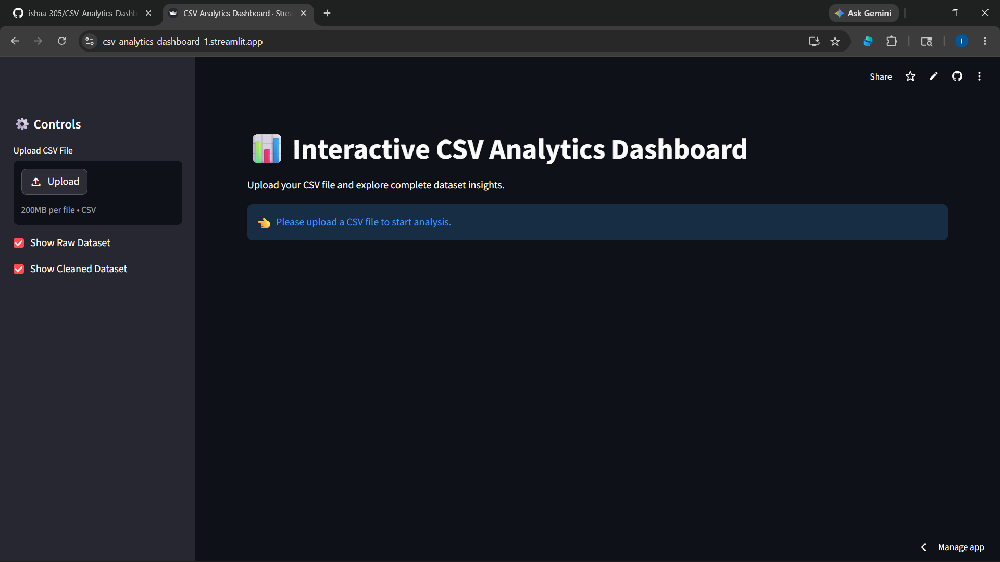
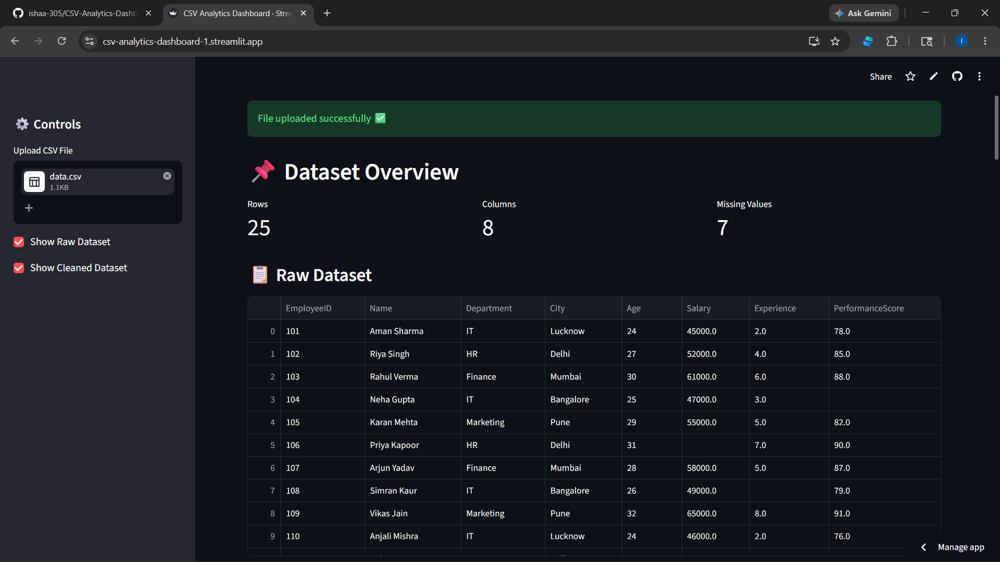
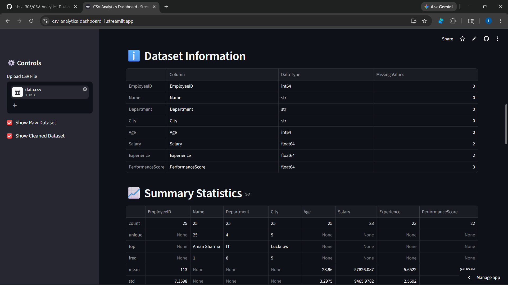
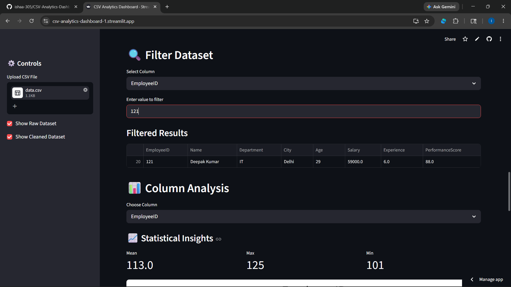
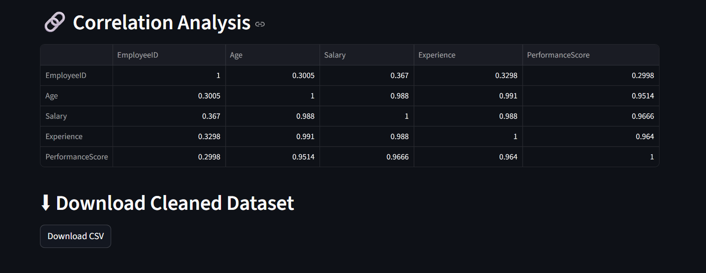

# CSV Analytics Dashboard

## Project Description

CSV Analytics Dashboard is an interactive data analysis application developed using Python. The project allows users to upload CSV datasets and perform multiple data analysis operations such as dataset preview, statistical analysis, missing value analysis, filtering, visualization, correlation analysis, and basic data cleaning.

The dashboard provides an easy and user-friendly way to analyze structured datasets using Python libraries.

---

## Technologies Used

- Python
- Pandas
- Matplotlib
- Streamlit

---

## Features

### Dataset Upload
- Upload CSV files directly into the dashboard

### Dataset Overview
- Display total rows
- Display total columns
- Display missing values count

### Dataset Preview
- View complete dataset in tabular format

### Dataset Information
- View column names
- View data types
- View missing value information

### Summary Statistics
- Mean
- Median
- Maximum
- Minimum
- Standard deviation
- Quartile values

### Missing Value Analysis
- Detect missing values in dataset
- Display null value count column-wise

### Data Cleaning
- Handle missing values using basic data cleaning techniques
- Generate cleaned dataset
- Remove duplicate records

### Dataset Filtering
- Filter records based on column values

### Column Analysis

#### Numeric Columns
- Mean analysis
- Maximum value
- Minimum value
- Distribution analysis

#### Categorical Columns
- Category frequency analysis
- Value count analysis

### Data Visualization
- Histogram charts
- Bar charts

### Correlation Analysis
- Analyze relationship between numeric columns

### Download Feature
- Download cleaned dataset as CSV file

### Interactive Dashboard
- Dynamic user interface
- Interactive data analysis experience

---

## Python Modules Used

### Pandas
Used for:
- Reading CSV files
- Data manipulation
- Data cleaning
- Statistical analysis
- Filtering operations

### Matplotlib
Used for:
- Histogram visualization
- Bar chart generation
- Data plotting

### Streamlit
Used for:
- Interactive dashboard creation
- File upload functionality
- Displaying tables and graphs
- User interaction handling

---

## How to Run the Project

### Install Required Libraries

```bash
python -m pip install pandas matplotlib streamlit
```
```bash
python -m streamlit run app.py
```

## GitHub Repository

https://github.com/ishaa-305/CSV-Analytics-Dashboard

## 🌐 Live Demo 

[Click here to view project](https://csv-analytics-dashboard-1.streamlit.app/) 

## 📸 Project Screenshots 

### Dashboard 
 

### Raw Dataset
 

### Information 
 

### Insights 
 

### Correlation 
 

## Author 

Isha Dwivedi